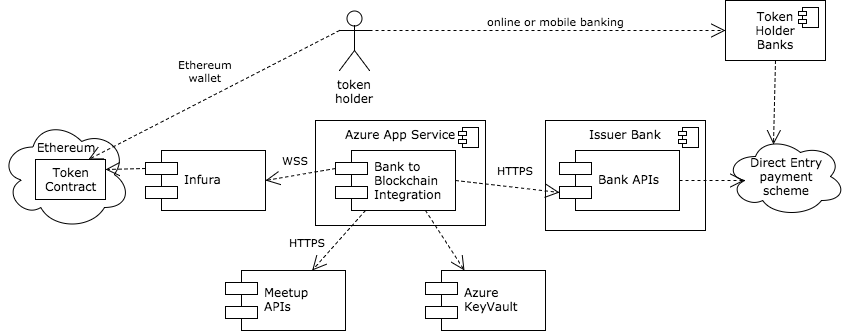

# Open Bank Token
The open bank token is aiming to create an [Ethereum](https://www.ethereum.org/) [ERC20](https://github.com/ethereum/EIPs/issues/20) token on the public Ethereum network that is automatically connected to an Australian dollar bank account via a bank Application Programming Interface (API).

The first version of the token will have limited use to reduce the risks to the participating bank, regulators and the entity that runs the experiment.

# Why
## Why do the experiment?
The Open Bank Token experiment is all about pushing the technology and regulatory boundaries while reducing the risk to established banks and regulators. It's about doing a small, controlled experiment using emerging blockchain technology so lessons can be learned for bigger, more complicated systems.

## Why create an AUD token?
One of the primary uses cases for blockchain technology is tokenising assets. These assets can be physical commodities like gold, coal or corn. They could be the rights to goods and services. They can be like shares with the rights to future profits or votes.

When an asset is traded it is usually traded for a currency. Tokenised assets can be traded for native cryptocurrencies like Ether, but cryptocurrencies are not what businesses need to account their activity in. Businesses are required by law to account for their activities in the currency of their jurisdiction. They don't want to be holding cryptocurrencies if they can depreciate relative to the currency they have to account in.

## Why not use traditional payments?
Programmable money is adding conditions to when money can be sent, who is can be sent to and the amount sent. It's also being able to exchange digital assets with digital money is atomic transactions which resolves a lot of delivery versus payment problems. For a more detailed explanation and example uses cases see [programmable money](https://github.com/naddison36/ethereum-programmable-money).

## Benefits
### Consumers
For this experiment, the consumers are members of the Sydney Ethereum community who can learn about how tokens can be issued, transferred and redeemed. They can also learn which wallets are the best to use, how to secure their private keys and how to check their transactions on the public chain.

### FinTechs
The concept of programmable money is an attractive one for FinTechs as it opens up a financial infrastructure that they can create innovative, new services for their customers. Escrow, automated asset transfers, faster direct debits and atomic execution of deals are all possible with programmable money. 

### Banks
Deposits are the main benefit to the bank which is the cheapest form of funding for the banks lending businesses. The best example is Tether's USDT which has around USD 440m at the time of writing.

There are also reputation gains to be had by being seen as innovative. From an investors perspective, innovative banks are more resistant to the digital disruption that is currently underway.

### Regulators
Blockchain technology is rapidly developing around the world, so it's essential that regulators are across these developments to protect consumers and the financial systems they regulate. It's also important for Australia to remain competitive in the emerging financial technology space to attract investment and build economic activity. By learning from experiments like this, regulators can ensure Australia has the policies and laws in place that make it a world-leading regulatory environment.

# What
The Ethereum token will be an ERC20 compliant token that can have tokens deposited and withdrawn. These deposits and withdrawals will be linked to an Australian bank account.

## Project principles

### Minimal legal and compliance risk
To ensure the first experiment will actually happen, the token has been constrained so the legal, regulatory compliance and bank risks are minimised. Rather than jumping straight to a token that can be used by anyone, the first version of the token will have the following constraints
1. Token holders can not hold more than 1000 tokens
2. There can not be more than 10m tokens on issue
3. There can only be one token issuer

### Open source
The project will open source the Ethereum smart contract and client integration so others can review, learn and build on top of it.

## Technical design principles

### No off-chain datastore
The on-chain data will not be synchronised to an off-chain database as it can get out of sync. The program will construct the on-chain state from emitted events in memory.

### Secure private keys
To improve the security, the private key of the token issuer will be held in a key store separated from the Ethereum node used to broadcast transactions and listen for events on the public network. In practical terms, it means Ethereum transactions will be signed and sent to the Ethereum node rather than being signed on the node.

### Duplicate protection
To avoid issuing too many tokens, a reference will be included in all deposit transactions which is checked to see they haven't already been used.

### Fully automated
As this is a side project, the operations of the token issuer has to be minimal. 

## Processes
The process to deposit, transfer and withdraw funds are documented [here](./processes.md).

## Integration Use Cases
The uses cases of the integration program between the bank account APIs and the Ethereum blockchain are documented [here](./integrationUseCases.md).

## Component Dependencies

* [Ethereum](https://ethereum.org/) is being used for the public blockchain. Others with smart contract capabilities could have been used but Ethereum is the dominant one at the time of development.
* [Solidity](http://solidity.readthedocs.io/en/develop/) is being used to develop the smart contract that will administer the token on the Ethereum network.
* [Infura](infura.io) is being used to connect to the Ethereum network. This saves having to run geth or parity Ethereum nodes that have to constantly be in sync with the main network.
* [Azure App Service](https://azure.microsoft.com/en-au/services/app-service/) from Microsoft will host the bank to blockchain integration component in the cloud. This is Platform as a Service (PaaS) so no virtual machines need to be managed.
* [Azure Key Vault](https://azure.microsoft.com/en-us/services/key-vault/) will be used to securely store the Ethereum private keys, the Meetup API key and the Bank authentication details.
* [Node.js](https://nodejs.org/en/) will be used to program the bank to blockchain integration component. This will connect to Infura via a secure websocket connection and connect to the meetup and bank APIs via secure http connections.
* [Meetup API](https://www.meetup.com/meetup_api/) will be used to map the depositor to an Ethereum address.
* Bank APIs are still to be finalised. Ideally, it would be [Open Bank Project](https://openbankproject.com/) APIs.
* Australia's [Direct Entry](http://www.apca.com.au/payment-systems/direct-entry) payment scheme will be used initially to transfer funds to and from the issuer's bank account. This will be switched to the [New Payment Platform](http://www.nppa.com.au/) when it becomes available.

## Token Contract
Details will be added here when the contract is deployed to the public test and main networks.

# Testing
This project comes with pre-configured Geth and Parity nodes for testing purposes in the [scripts](./scripts) folder. See the scripts [README](./scripts/README.md) for more details.

# Future Versions
When the [New Payments Platform](http://www.nppa.com.au/) (NPP) comes to Australia in 2018, it makes it possible for the token holder's address to be included in the payment's reference field. This means the registration of the token holders Ethereum address on a third party identity system like Meetup can be dropped.