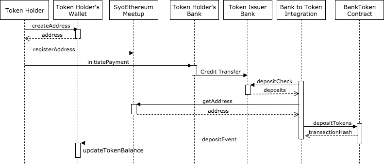
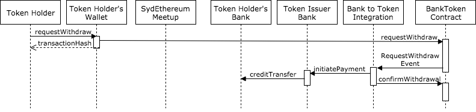

# Open Bank Token Processes

## Deposits
The process for a token holder to deposit funds with the token issuer who then issuer tokens to the token holder.

1. Token Holder creates an Ethereum address using their wallet.

There different wallets that allow a user to create accounts. Online examples are [MyEtherWallet](https://www.myetherwallet.com/) and [MetaMask](https://metamask.io/). Ones that require a local node to be run are [Mist](https://github.com/ethereum/mist#mist-browser) and [Parity](https://parity.io). A mobile wallet example is [imToken](https://token.im/).

An Ethereum address, or an externally owned account (EOA), consists of a private and public key. The main job of the wallet is to safely store the private key of the user's address.

The public key is the actual address that is shared with others. It's also what the tokens will be issued to later in the process. The Ethereum public address is 42 characters and starts with `0x`.

2. Watch bank token contract.

The token holder adds the Bank Token contract to their Ethereum wallet. This will then display the number of tokens the user has. Initially, the balance will be zero. 

3. Token holder registers their Ethereum address in their Meetup profile.

Since the Ethereum address is too big to send in an Australian electronic transfer between bank accounts, a different reference number has to be used to identify which address the tokens should be issued to. Following what was previously done with the [Sydney Ethereum Meetup token](https://github.com/SydEthereum/meetup-token#meetup-token), the address of the token holder will be registered in their Meetup profile for the [Sydney Ethereum meetup](http://sydeth.com/) group. This is done by saving the address in the introduction section of the member's profile. For example https://www.meetup.com/SydEthereum/members/140526032/.

4. Token holder initiates a bank payment.

Through their bank, the token holder makes a payment to the Token Issuer's bank account. In Australia, this is currently done via an Electronic Funds Transfer. The reference field of the payment needs to include the token holder's meetup identifier.

5. Token Holder's Bank does a credit transfer to the Issuer's Bank

The token holder's bank will send the funds to the Token Issuer's bank. In Australia, that is currently done via the Direct Entry system and will clear a number of times each weekday.

6. Bank to Token Integration checks for new deposits

The token issuer will periodically run a program to look for new deposits in the the Token Issuer's bank account. This will use bank Application Programming Interfaces (APIs) so the process is automated.

7. Bank to Token Integration gets Ethereum address

For each new deposit, the payment reference will be used to get the meetup identifier. The program will then use the [Meetup APIs](https://www.meetup.com/meetup_api/) to get the Ethereum address from the introduction field of the token holder's Sydney Ethereum profile.

8. Bank to Token Integration issues tokens

Assuming an Ethereum address was retried from the Meetup profile, the Bank to Token Integration program issues the same number of tokens to the Ethereum address as the number of dollars that were deposited in the Token Issuer's bank account.

The token contract records the token holder's address so they can now also receive token transfers from other token holders.

9. Token holder's wallet updated the token balance

This can happen a number of different ways. The wallet can either look at the token state when the token holder next looks at their wallet. Or the wallet can be listening for events emitted from the Token Contract so it can update the token holder's token balance.

## Withdrawals
The process for a token holder to withdraw their tokens so the token issuer can pay them from the deposited funds.

1. Token holder requests a withdrawal on the Bank Token contract

The token holder uses their Ethereum wallet to call the requestWithdraw function on the token contract. The wallet will use the token holder's private key to sign the Ethereum transaction and broadcast it to the Ethereum network so it can be mined. 

2. Token contract redeems tokens and emits a RequestWithdraw events.

The token contract validated that the sender of the Ethereum transaction has enough tokens to withdraw. If not the request withdraw function will fail.

If there's enough tokens, the contract will reduce the senders tokens and the total supply by the amount being withdrawn.

The last thing the token contract does is emit a RequstWithdraw event for any event subscribers to process.

3. Bank Token Integration sends payment to token holder and confirms withdrawal on the token contract.

The bank token integration program receives the RequestWithdrawal event from the token contract. It checks that it has not already processed this withdrawal by checking the withdraw number in the event against the withdraw transactions it has already submitted to the bank.

If not a duplicate RequestWithdraw event, the bank token integration program will call the Token Bank's API to initiate a payment to the token holder's bank account. The payment reference will include the withdrawal number emitted from the RequestWithdrawal event from the token contract.

Once the Bank API has successfully responded to the payment initiation request, the bank token integration program will call the token contract to confirm the withdrawal using the withdrawal number emitted in the RequestWithdrawal event. 

4. Token issuer's bank does a credit transfer to the token Holder's bank.

In Australia this will be an electronic funds transfer until the New Payments Platform becomes available.